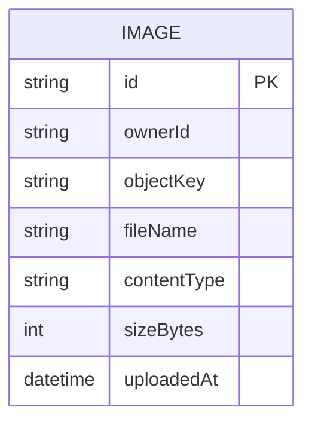

# Domain Model

The core entity is the Image, owned by exactly one signed-in User (identity comes from Thunder — no local User table). Each Image record tracks the S3 object key the actual bytes live under and belongs to the user who uploaded it.

- `ownerId` is the caller's subject id from the Thunder-signed assertion — never supplied by the client.
- `objectKey` is the S3 key the API generates when issuing an upload presigned URL, namespaced per owner to avoid collisions.

